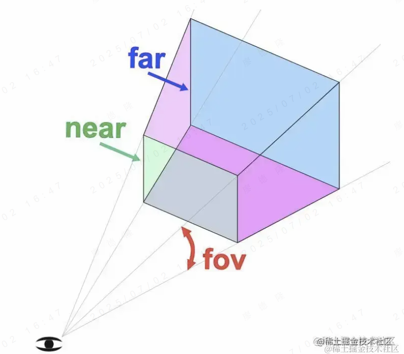

[toc]

# ThreeJS

## 基础概念

- Scene：场景

    - Group：组

        - Mesh：网格模型

            - Geometry：几何体

            - Metial：材质
        
    - Light：灯光

        - AmbientLight：环境光，均匀的照亮场景的所有物体（所以也没有方向）

        - DirectionalLight：平行光，平行的光线，一般模拟非常远距离的光线照射，如太阳光

        - PointLight：点光源，从一个点出发发射的光源，比如灯泡

        - SpotLight：聚光灯，照射出一个圆锥体的光源，比如手电筒，舞台聚光灯

        - HemisphereLight：半球光，两种颜色的光，比如天空到地面两种颜色互相叠加

        - RectAreaLight：矩形光，矩形平面的光，类似从窗户或LED灯管等一个面发出光的效果

    - Camera：相机

        - FOV: 可视化锥体角度（从上到下的角度范围）

        - ASPECT: 可视化锥体的宽高比（根据角度FOV和宽高比，能够得到近端和远端的具体宽高大小）

        - NEAR: 近端（近端距离相机的距离）

        - FAR: 远端（远端距离相机的距离）

- Renderer：渲染器

## 可视化调试

使用 `Data-GUI` 进行可视化调试，便于合理的设置各项参数值

## Helper

- AxesHelper：坐标轴辅助对象

- GridHelper：网格辅助对象，可再XZ轴面上绘制网格，用来标识地面，方便进行物品位置设定辅助

- CameraHelper：相机辅助对象，可视化相机的远近点以及可视化锥体范围

- ArrowHelper：箭头辅助对象，可视化一个有方向的箭头，可以自定义进行箭头绘制用于标识方向

- PolarGridHelper：极坐标网格辅助对象，可视化一个极坐标平面

## 模型大小计算

引入的模型，不同模型的大小都不同，如果想要对不同模型统一大小放置，则需要知道各个模型的大小，这个就涉及到包围盒的概念了，要计算模型的大小，就是计算它的最小包围盒的长宽高：

Three.js 提供了计算包围盒的 api：

1. 使用`new THREE.Box3()`

```js
const box = new THREE.Box3();

const mesh = new THREE.Mesh(
	new THREE.SphereGeometry(),
	new THREE.MeshBasicMaterial()
);

// ensure the bounding box is computed for its geometry
// this should be done only once (assuming static geometries)
mesh.geometry.computeBoundingBox();

// ...

// in the animation loop, compute the current bounding box with the world matrix
box.copy( mesh.geometry.boundingBox ).applyMatrix4( mesh.matrixWorld );
```

2. 使用`new THREE.BoxHelper(mesh, color)`可视化辅助查看包围盒

```js
const sphere = new THREE.SphereGeometry();
const object = new THREE.Mesh( sphere, new THREE.MeshBasicMaterial( 0xff0000 ) );
const box = new THREE.BoxHelper( object, 0xffff00 );
scene.add( box );
```

Box3Helper：可视化 Box3 包围盒
setFromObject：和 expandByObject 一样，计算对象和子对象的包围盒
getSize：计算包围盒大小，不用自己计算
expandByScalar：扩展包围盒
intersectsBox：检测包围盒是否相交，可用来做碰撞检测
intersect：计算相交部分大小
union：计算并集大小
getCenter：获取包围盒中心位置坐标

## 相机

### 1. 透视相机PespectiveCamera

它符合人眼的规律，近大远小。



### 2. 正投相机OrthographicCamera

不管多远，看到的都一样大，它的范围就不需要角度啥的了，只需要 left、right、top、bottom、near、far 这 6 个值构成立方体。

相比透视投影相机，正投影相机确实用的少，但是在计算阴影的时候，会用到正投影相机。

